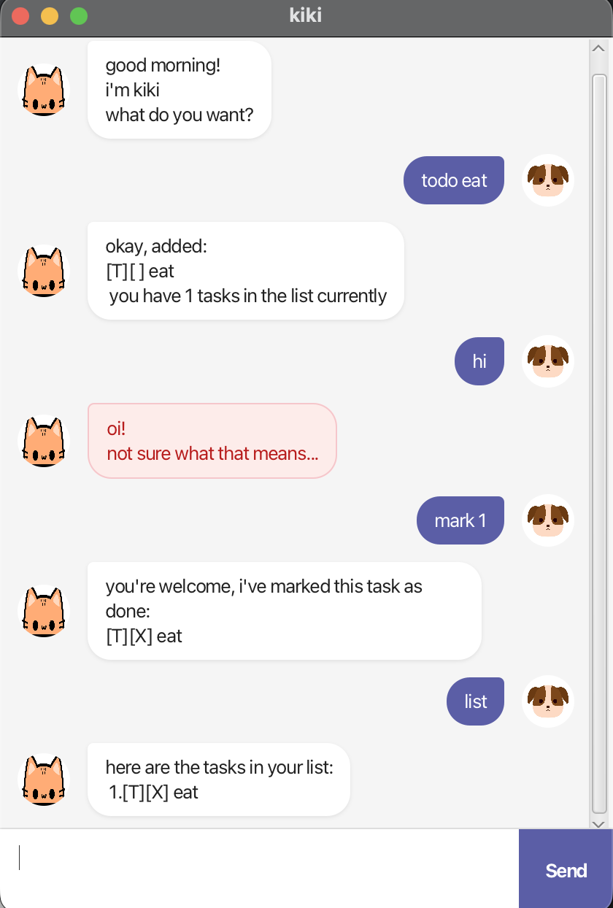

# Kiki User Guide



Kiki is a **desktop chatbot for managing tasks** — todos, deadlines, and events. It is optimised for use via a Command Line Interface (CLI) while still having the benefits of a Graphical User Interface (GUI).

---
* [Quick Start](#quick-start)
* [Features](#features)
    * [List all tasks: `list`](#list-all-tasks-list)
    * [Add a todo: `todo`](#add-a-todo-todo)
    * [Add a deadline: `deadline`](#add-a-deadline-deadline)
    * [Add an event: `event`](#add-an-event-event)
    * [Mark a task as done: `mark`](#mark-a-task-as-done-mark)
    * [Unmark a task: `unmark`](#unmark-a-task-unmark)
    * [Delete a task: `delete`](#delete-a-task-delete)
    * [Find tasks by keyword: `find`](#find-tasks-by-keyword-find)
    * [Snooze a deadline or event: `snooze`](#snooze-a-deadline-or-event-snooze)
    * [Exit: `bye`](#exit-bye)
    * [Saving your data](#saving-your-data)

---
## Quick Start

1. Ensure you have **Java 17** or above installed.
2. Download the latest `kiki.jar` from the releases page.
3. Copy the file to the folder you want to use as Kiki's home folder.
4. Open a terminal, `cd` into that folder, and run:
```
   java -jar kiki.jar
```
5. Type a command in the chat box and press **Enter** or click **Send**.

---

## Features

### List all tasks: `list`

- Shows all tasks currently in your list, numbered from 1.

**Format:** `list`

**Example output:**
```
here are the tasks in your list:
 1.[T][ ] buy groceries
 2.[D][ ] submit report (by: Jun 5 2026, 11:59PM)
 3.[E][ ] team meeting (from: Jun 6 2026, 2:00PM to: Jun 6 2026, 4:00PM)
```

---

### Add a todo: `todo`

- Adds a task with no date attached.

**Format:** `todo DESCRIPTION`

**Example:** `todo read a book`

---

### Add a deadline: `deadline`

- Adds a task that must be done by a specific date and time.
- Dates must follow the format `D/M/YYYY HHmm`.  
  e.g. `2/6/2026 1430` means 2 June 2026, 2:30 PM.

**Format:** `deadline DESCRIPTION /by DATE`


**Example:** `deadline submit assignment /by 5/6/2026 2359`

---

### Add an event: `event`

- Adds a task that spans a start and end date and time.
- Dates must follow the format `D/M/YYYY HHmm`.  
    e.g. `2/6/2026 1430` means 2 June 2026, 2:30 PM.

**Format:** `event DESCRIPTION /from DATE /to DATE`

**Example:** `event team meeting /from 6/6/2026 1400 /to 6/6/2026 1600`

---

### Mark a task as done: `mark`

- Marks the task at the given index as completed.

**Format:** `mark INDEX`

**Example:** `mark 2`

---

### Unmark a task: `unmark`

- Marks the task at the given index as not done.

**Format:** `unmark INDEX`

**Example:** `unmark 2`

---

### Delete a task: `delete`

- Removes the task at the given index from the list permanently.

**Format:** `delete INDEX`

**Example:** `delete 3`

---

### Find tasks by keyword: `find`

- Searches for tasks whose descriptions contain the given keyword (case-insensitive).

**Format:** `find KEYWORD`

**Example:** `find meeting`

**Example output:**
```
here are the matching tasks in your list:
 1.[E][ ] team meeting (from: Jun 6 2026, 2:00PM to: Jun 6 2026, 4:00PM)
```

---

### Snooze a deadline or event: `snooze`

Postpones a deadline or event by updating its date to a new one.
- For a **deadline**, the due date is updated.
- For an **event**, the end date is updated.
- Cannot be used on todos.
- Dates must follow the format `D/M/YYYY HHmm`.  
    e.g. `2/6/2026 1430` means 2 June 2026, 2:30 PM.

**Format:** `snooze INDEX DATE`

**Example:** `snooze 2 10/6/2026 2359`

---

### Exit: `bye`

- Closes the application.

**Format:** `bye`

---

## Saving Your Data

Kiki saves your tasks automatically after every command that changes the list. The data is stored in `data/kiki.txt` in the same folder as the jar file. There is no need to save manually.

---

## Command Summary

| Action | Format | Example |
|--------|--------|---------|
| List | `list` | `list` |
| Add todo | `todo DESCRIPTION` | `todo read a book` |
| Add deadline | `deadline DESCRIPTION /by DATE` | `deadline submit report /by 5/6/2026 2359` |
| Add event | `event DESCRIPTION /from DATE /to DATE` | `event meeting /from 6/6/2026 1400 /to 6/6/2026 1600` |
| Mark done | `mark INDEX` | `mark 1` |
| Unmark | `unmark INDEX` | `unmark 1` |
| Delete | `delete INDEX` | `delete 2` |
| Find | `find KEYWORD` | `find book` |
| Snooze | `snooze INDEX DATE` | `snooze 2 10/6/2026 2359` |
| Exit | `bye` | `bye` |
